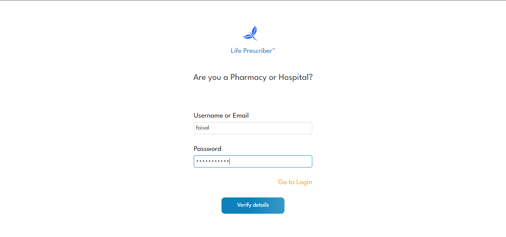
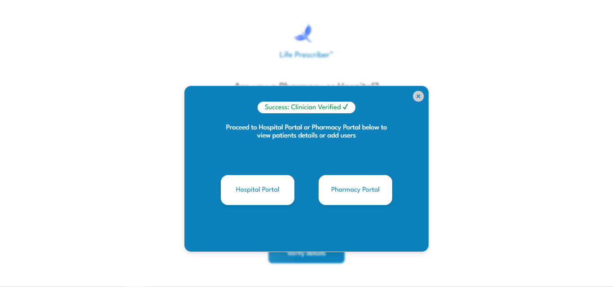
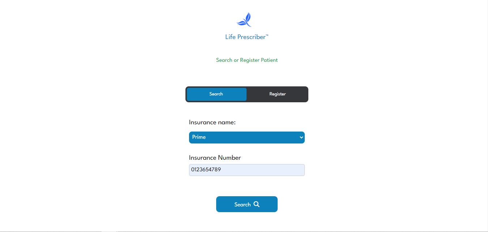
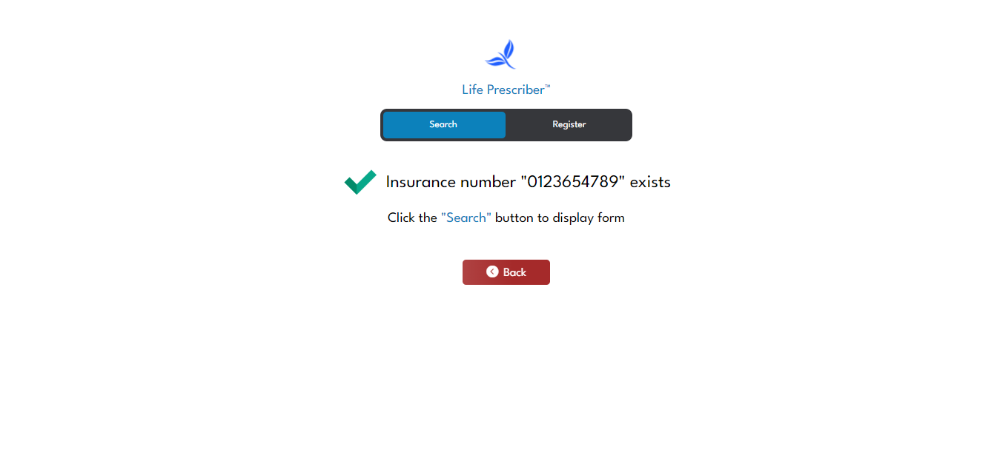
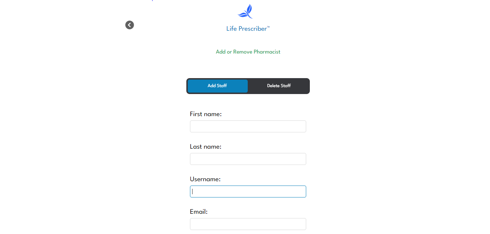
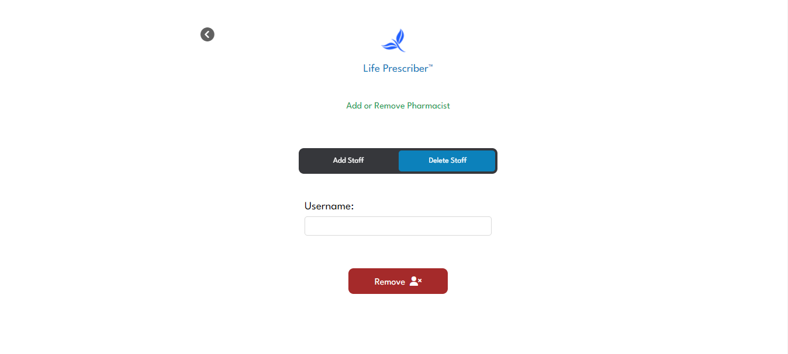
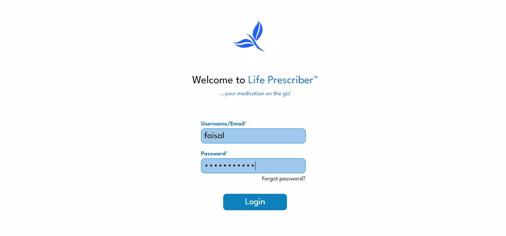
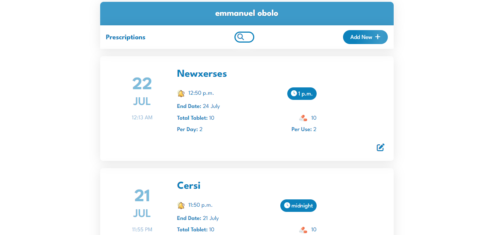
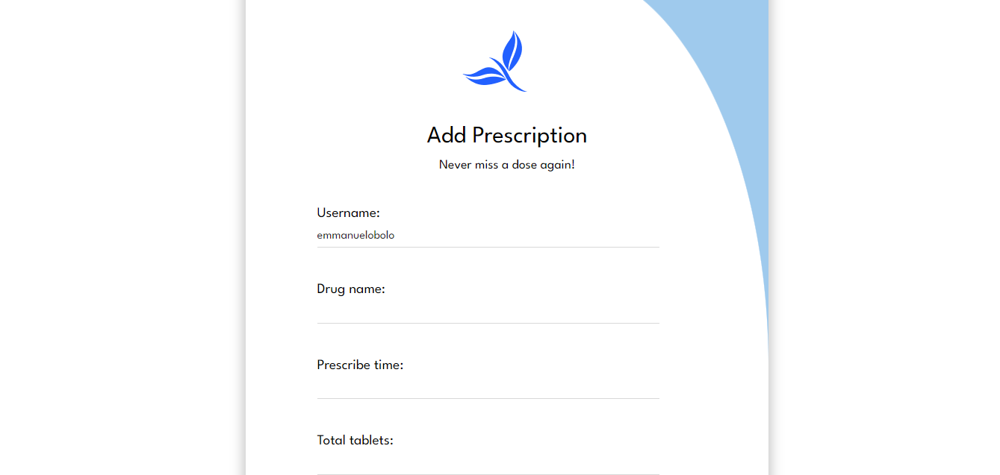
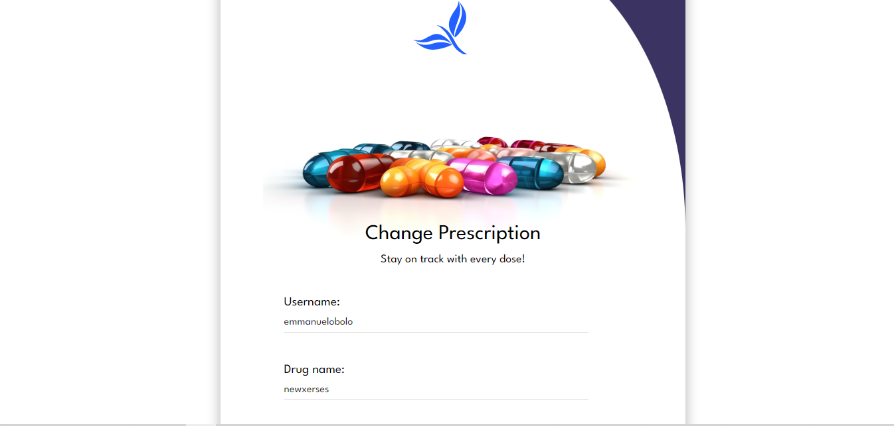

      

# Life Prescriber

Life Prescriber is a web application designed to help medical patients adhere to their medication schedules through timely email reminders. Clinicians can onboard patients, manage medication schedules, and monitor adherence through a comprehensive backend system.

## Features

- *Patient Onboarding*: Easy onboarding of patients by clinicians.
- *Email Reminders*: Automated email notifications for medication reminders.
- *Medication Tracking*: Track patient medication adherence through the backend.
- *Custom Authentication*: Secure custom authentication backend.
- *Admin Interface*: Enhanced admin interface for managing users and prescriptions.
- *Task Scheduling*: Utilizes Celery for scheduling email reminders.

# Navigation

Test Clinician Login Credentials:
   - Username: faisal
   - Password: sitdownhere

- Accessing Life Prescriber:
   From your web browser, navigate to the [General Homepage Login](https://turingmachines.pythonanywhere.com/prescription_ongo/general_home/)
   

- Verify Login Information:
   Enter login credentials provided by system admin at onboarding and click "verify details"
   

   On successful verification, you can now navigate to either the "Hospital Portal" or "Phamarcy Portal" depending on your role on the system. 
   

- Hospital Portal:
   In the hospital portal, you can onboard new patient(s) to the platform by clicking "Register" and filling in required information or use "Search" to query the platform using a patient's 'Insurance Provider Name' and 'Insurance ID Number'.
   

   Enter required information
   

   Displays Response Message
   

- Pharmacy Portal:
   In the pharmacy portal, new pharmacy staff(s) can onboarded or deleted.
   
   

- Login into Life Prescriber Clinician Dashboard:
   To access patient's medical information securely stored on the database for creating, modifying and/or tracking prescriptions, clinicians can navigate to the login interface by clicking "Go to Login" from "[General Homepage Login](https://turingmachines.pythonanywhere.com/prescription_ongo/general_home/)" and providing their credentials.
   

   Clinician(s) enters patient's credentials (Insurance Name and Insurance ID No.) to search for patient's prescritption information in the database.
   

   Search returns patient's information if found.
   

   Clinician(s) can click on "View Prescription" to see patient's prescription details. This displays every prescription the patient has received since onboarding into Life Prescriber. This page shows detailed information on each prescription (Drug name, Datetime of prescription, Time of first dose, Notification time, End date, Total no. tablets, Amount of tablets per dose, Remaining tablets, Dosage per day)
   

   Clinician(s) can add new prescription by clicking the "Add New".
   

   Clinician(s) can also click the edit button to make changes to prescriptions where necessary.
   


## Installation

### Prerequisites

- Python 3.10+
- Redis (for Celery) watch video [Redis installation](https://www.youtube.com/watch?v=DLKzd3bvgt8&t=197s)

### Setup

1. *Create and activate a virtual environment:*
      ```sh
      python -m venv your_virtual_environment_name
      source venv/bin/activate   # On Windows use `your_virtual_environment_name\Scripts\activate`
      ```

3. *Clone the repository:*
      ```sh
      git clone https://github.com/olugbeminiyi2000/MedHack_Life_Prescriber.git
      cd MedHack_Life_Prescriber/
      ```
      
5. *Install dependencies:*
      ```sh
      pip install -r requirements.txt
      ```

7. *Set up the Django project:*
      ```sh
      cd Life_Prescriber
      code/vi settings.py # adjust settings.py making DEBUG=True, EMAIL_HOST_USER to your test email adress, and finally set EMAIL_HOST_PASSWORD using google SMTP Authentication.
      python manage.py makemigrations
      python manage.py migrate
      python manage.py createsuperuser --email=your_email --username=your_username
      python manage.py check
      python manage.py runserver
      ```

9. *Set up Celery:*
   - open up 2 command line interface at vscode terminal Launch Profile.
   - then change directory to MedHack_Life_Prescriber/Life_Prescriber/ if not there.
      ```sh
      celery -A Life_Prescriber worker --pool=solo -l INFO
      celery -A Life_Prescriber beat -l INFO
      ```

## Usage

- Log in to the admin panel at http://127.0.0.1:8000/admin/ using your superuser credentials.
- Onboard patients and manage prescriptions.
- Track patient medication adherence through the backend system.

## Configuration
## django admin/sites.py configuration !important
   ```sh
   code\vi your_python_virtual_env/Lib/sites-packages/django/contrib/admin/sites.py
   ```
   ```py
   # sites.py
   # add this to where all modules are imported really !important
   from django.contrib.auth import get_user_model, logout
   
   # then at login function
       @method_decorator(never_cache)
       def login(self, request, extra_context=None):
           """
           Display the login form for the given HttpRequest.
           """
           if request.method == "GET" and self.has_permission(request):
               # Already logged-in, redirect to admin index
               index_path = reverse("admin:index", current_app=self.name)
               return HttpResponseRedirect(index_path)
            
           """
           Very Important! check if the user trying to login is not of the settings.AUTH_USER_MODEL
           """
           SETTINGS_USER = get_user_model()
           if request.user.is_authenticated and not isinstance(request.user, SETTINGS_USER):
               logout(request)**
   
           # Since this module gets imported in the application's root package,
           # it cannot import models from other applications at the module level,
           # and django.contrib.admin.forms eventually imports User.
           from django.contrib.admin.forms import AdminAuthenticationForm
           from django.contrib.auth.views import LoginView
   
           context = {
               **self.each_context(request),
               "title": _("Log in"),
               "subtitle": None,
               "app_path": request.get_full_path(),
               "username": request.user.get_username(),
           }
           if (
               REDIRECT_FIELD_NAME not in request.GET
               and REDIRECT_FIELD_NAME not in request.POST
           ):
               context[REDIRECT_FIELD_NAME] = reverse("admin:index", current_app=self.name)
           context.update(extra_context or {})
   
           defaults = {
               "extra_context": context,
               "authentication_form": self.login_form or AdminAuthenticationForm,
               "template_name": self.login_template or "admin/login.html",
           }
           request.current_app = self.name
           return LoginView.as_view(**defaults)(request)
   ```

### Celery Configuration

In Life_Prescriber/celery.py:
   ```python
   app.conf.beat_schedule = {
       'task-name': {
           'task': 'prescription_ongo.tasks.send_async_email',
           'schedule': crontab(minute='*/10'),
       },
   }
   # very important do not change
   app.conf.task_default_queue = 'default'
   ```

## License

This project is licensed under the MIT License. See the [LICENSE](LICENSE) file for details.

---

### Additional Included Files

1. *LICENSE*: The licensing information for the project.
2. *requirements.txt*: List of dependencies required to run the project.
3. *.gitignore*: Specifies files and directories to be ignored by Git.
